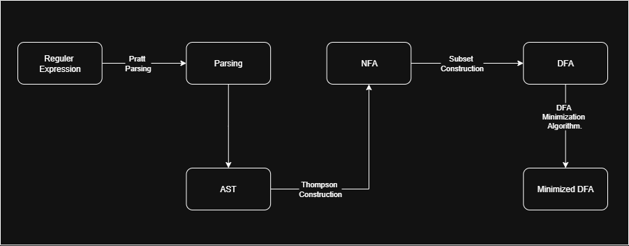

# Ruldani_Scanner_Lexer

Ruldani scanner lexer adalah project chain dari [ruldani visual programming](https://github.com/Perpuskita/Ruldani_VisualProgramming). Ruldani scanner lexer adalah tools untuk melakukan lexical analysis dengan pendekatan finite automata. 

## Table of content
- [Tujuan](#tujuan)
- [Roadmap](#roadmap)
- [Teknik Konversi](#teknik-konversi)
- [Flowchart](#flowchart-program)

## Tujuan
Tujuan dari project ini adalah untuk mempelajari teori automata, mengenal teori compiler, mempelajari tahapan lexical analysis serta sebagai tools pengembangan untuk ruldani visual programming.

## Roadmap

| Fitur | Deskripsi | Status |
|-------|-------------|----------|
| RE Printing   | Melakukan printing posibility terhadap reguler expression   | ✅ complete   |
| RE Eval   | Melakukan validasi token menggunakan reguler expression | ✍🏽 development   |
| NFA Visualized   | Memvisualisasikan NFA | ✍🏽 development   |
| DFA Visualized   | Memvisualisasikan DFA | ✍🏽 development   |
| RE to NFA   | Mengkonversi RE kedalam bentuk NFA | ✍🏽 development   |
| NFA to DFA   | Mengkonversi NFA kedalam bentuk DFA | ✍🏽 development   |
| RE to DFA   | Mengkonversi RE kedalam bentuk DFA | ✍🏽 development   |

## Teknik konversi
Teknik konversi atau algoritma yang digunakan adalah thompson construction, subset construction, dan hopcroft algorithm. thompson's construction digunakan untuk mengkonversi reguler expression kedalam non-deterministic finite automata. subset construction digunakan untuk mengkonversi non-deterministic finite automata kedalam deterministic automata. Hopcroft algorithm digunakan untuk membuat deterministic finite automata agar memiliki proses yang lebih kecil namun tetap mendeskripsikan deterministic finite automata yang sebenarnya.

## Flowchart program
under - construction T^T

## Example
under - construction T^T

## Contibute
under - construction T^T
