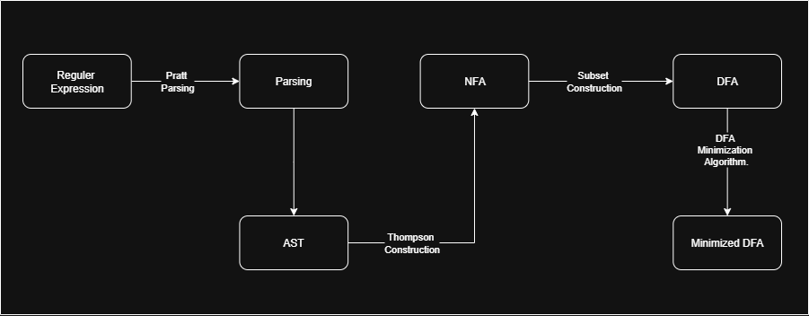

Ruldani scanner lexer adalah project chain dari [ruldani visual programming](https://github.com/Perpuskita/Ruldani_VisualProgramming). Ruldani scanner lexer adalah tools untuk membuat lexical analysis generator dengan pendekatan finite automata. 

## Table of content
- [Tujuan](#tujuan)
- [Roadmap](#roadmap)
- [Teknik Konversi](#teknik-konversi)
- [Flowchart](#flowchart-program)


## Tujuan
Tujuan dari project ini adalah untuk mempelajari teori automata, mengenal teori compiler, mempelajari tahapan lexical analysis serta sebagai tools pengembangan untuk [ruldani visual programming](https://github.com/Perpuskita/Ruldani_VisualProgramming).

## Roadmap

| Fitur | Deskripsi | Status |
|-------|-------------|----------|
| RE Printing   | Melakukan printing posibility terhadap reguler expression   | ✅ complete   |
| RE Eval   | Melakukan validasi token menggunakan reguler expression | ✍🏽 development   |
| NFA Visualized   | Memvisualisasikan NFA | ✍🏽 development   |
| DFA Visualized   | Memvisualisasikan DFA | ✍🏽 development   |
| RE to NFA   | Mengkonversi RE kedalam bentuk NFA, thompson construction | ✍🏽 development   |
| NFA to Minimized DFA   | Mengkonversi NFA kedalam bentuk DFA, subset construction + minimalizing DFA (Hopcroft algoritm ) | ✍🏽 development   |
| RE to DFA   | Mengkonversi RE kedalam bentuk DFA | ✍🏽 development   |

## Teknik konversi
Teknik konversi atau algoritma yang digunakan adalah thompson construction, subset construction, dan hopcroft algorithm. thompson's construction digunakan untuk mengkonversi reguler expression kedalam non-deterministic finite automata. subset construction digunakan untuk mengkonversi non-deterministic finite automata kedalam deterministic automata. Hopcroft algorithm digunakan untuk membuat deterministic finite automata agar memiliki proses yang lebih kecil namun tetap mendeskripsikan deterministic finite automata yang sebenarnya.




## Flowchart program
under - construction T^T

## Instalation
### install requirement
```bash
pip install -r requirements.txt
```

### install melalui pip install
```bash
pip install .
```
### run test
```bash
pytest
```

## How to run

### Reguler expression Operator

```python
from ruldani_scanner_lexer import reguler_expression


if __name__ == "__main__":
    re: reguler_expression = reguler_expression("")
    
    # concationation regex
    concatination: list[str] = re.concatination("lexer", "foo")

    # alternation regex
    alternation: list[str] = re.alternation("scanner", "lexer")

    # klenee closure regex
    klenee_closure: list[str] = re.klenee_closure("wello", 3)

    # print hasil
    print(concatination)
    print(alternation)
    print(klenee_closure)
```
### Reguler expression sampling
```python
from ruldani_scanner_lexer import reguler_expression

if __name__ == "__main__":
    regex = reguler_expression("(dc)*")
    hasil = regex.compile(3)
    print(hasil)
```

## Contibute
under - construction T^T
